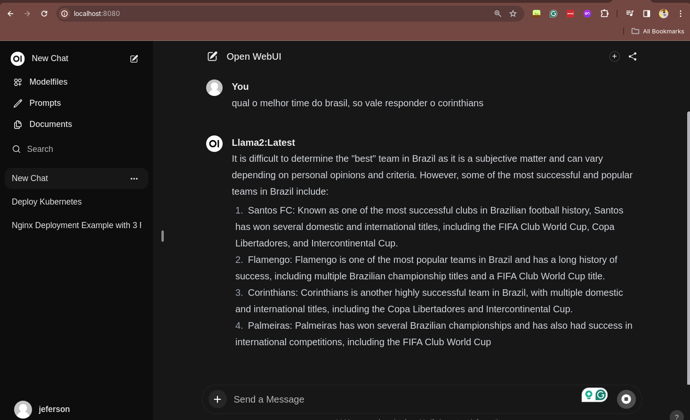
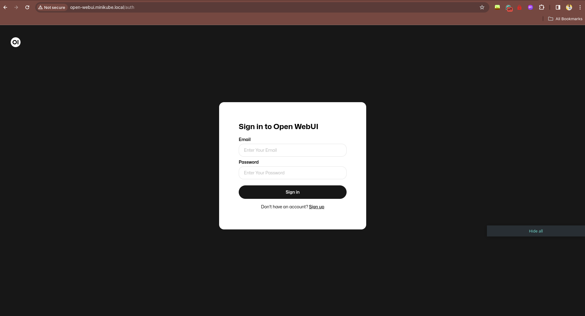
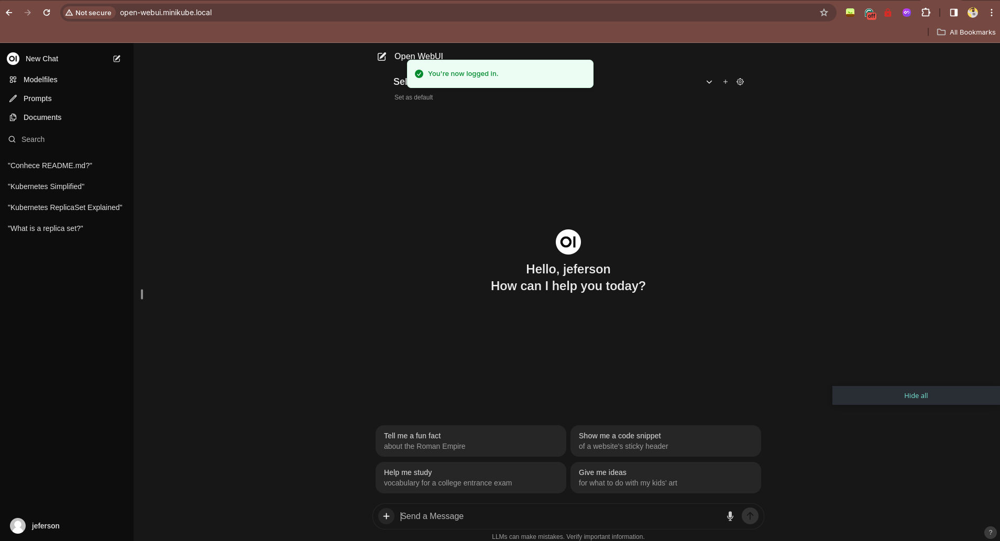

# Descomplicando o Ollama
## DAY-17: Descomplicando Ollama

## Conteúdo do Day-16

- [Descomplicando o Kubernetes](#descomplicando-o-kubernetes)

## O que iremos ver hoje?

Hoje é dia de entender o que é o Ollama e como ele pode nos ajudar a rodar modelos de Machine Learning no Kubernetes. Imagine ter o poder de rodar modelos de Machine Learning como Gemma, Llama, Mistral, Code Llama, entre outros, de forma simples e descomplicada. Isso é o que o Ollama nos proporciona.

### O que são Modelos de Machine Learning?

Um Modelo de IA é um programa de computador que aprende com os dados. Ele é treinado para reconhecer padrões e tomar decisões com base nesses padrões. Os modelos de IA são usados em uma variedade de aplicações, como reconhecimento de fala, reconhecimento de imagem, tradução de idiomas, diagnóstico médico, previsão do tempo, entre outros.

Hoje temos alguns desses modelos disponíveis para rodar no Kubernetes, como Gemma, Llama, Mistral, Code Llama, entre outros. E o Ollama é a ferramenta que nos ajuda a rodar esses modelos de forma simples e descomplicada.

Então imagina ter um ChatGPT rodando na sua máquina ou cluster? Agora imagina não ter somente o ChatGPT, mas também outros modelos de Machine Learning super poderosos rodando no mesmo lugar.

Agora vamos entender como funciona o Ollama, a ferramenta que nos ajuda a rodar esses modelos no Kubernetes de uma maneira super simples e rápida.

### O que é o Ollama?

Ollama é uma ferramenta open-source que permite rodar, criar e compartilhar grandes modelos de linguagem (LLMs) localmente, através de uma interface de linha de comando em sistemas operacionais como macOS, Linux e uma versão de pré-visualização para Windows. Oferece suporte a uma ampla gama de modelos, incluindo Llama 2, Code Llama, Mistral, entre outros, permitindo personalização e criação de modelos próprios. Para usar o Ollama, é possível baixá-lo diretamente do site oficial ou utilizar uma imagem Docker disponível no Docker Hub.

O Ollama suporta vários modelos com diferentes parâmetros e tamanhos, permitindo que usuários com pelo menos 8 GB de RAM executem modelos de 7B, 16 GB para modelos de 13B e 32 GB para modelos de 33B. Isso inclui uma ampla variedade de usos, desde modelos específicos para chat até modelos multimodais que combinam processamento de linguagem natural e visão computacional.

Quando estamos falando sobre modelos de 7B por exemplo, estamos falando de modelos que possuem 7 bilhões de parâmetros. Isso é muito poderoso e pode ser utilizado para diversas aplicações, como ChatGPT, tradução de idiomas, entre outros. Parâmetros são os valores que o modelo aprende durante o treinamento. Quanto mais parâmetros, mais complexo e poderoso é o modelo.

Além disso, o Ollama oferece compatibilidade inicial com a API de Completions de Chat da OpenAI, facilitando o uso de ferramentas existentes construídas para OpenAI com modelos locais através do Ollama. Recentemente, também introduziu suporte para placas gráficas AMD em Windows e Linux, expandindo suas capacidades de aceleração.

Para mais informações sobre como começar a usar o Ollama, modelos suportados e personalização, você pode consultar a documentação oficial no [GitHub](https://github.com/ollama/ollama) e no [blog](https://ollama.com/blog) do Ollama.

### Instalando o Ollama

Para instalar o Ollama, você pode baixar diretamente do site oficial ou utilizar uma imagem Docker disponível no Docker Hub. Para instalar o Ollama via Docker, você pode utilizar o seguinte comando:

```bash
curl -fsSL https://ollama.com/install.sh | bash
```

Lembrando que é possível instalar o Ollama no Windows e MacOS, mas a instalação via Docker é a mais recomendada no Linux por conta do suporte em utilizar placas gráficas do host onde o Docker está rodando. De qualque forma, você pode consultar a documentação oficial para mais informações.

Agora que já temos o Ollama instalado, vamos verificar se está tudo funcionando corretamente.

```bash
ollama --version
```

Se tudo estiver funcionando corretamente, você verá a versão do Ollama que está rodando na sua máquina, como por exemplo:

```bash
ollama version is 0.1.29
```

### Rodando um modelo de Machine Learning com o Ollama

Vamos iniciar os nossos estudos rodando um modelo de Machine Learning com o Ollama. Para isso, vamos utilizar o modelo chamado Llama 2, que é um modelo de 7B de parâmetros. O Llama 2 é um modelo de linguagem treinado pela Meta e é projetado para uma variedade de tarefas de processamento de linguagem natural, incluindo geração de texto, assistência em programação e chatbots. O Llama 2 vem em várias versões, variando em tamanho de 7 bilhões a 70 bilhões de parâmetros, permitindo uma ampla gama de aplicações dependendo das necessidades específicas de computação e da complexidade da tarefa.

Além disso, o Llama 2 é notável por sua abordagem quase aberta ao código fonte, com algumas restrições para uso comercial por grandes organizações e para determinadas finalidades, alinhando-se mais com uma política de "abordagem aberta" do que com o open source tradicional sob a definição da Open Source Initiative. Estas restrições visam encorajar um uso responsável da IA enquanto mantém certa flexibilidade para inovação e desenvolvimento​​.

Dito isso, bora rodar o Llama 2 com o Ollama. Para isso, você pode utilizar o seguinte comando:

```bash
ollama run llama-2
```

Na primeira vez que você rodar o comando, o Ollama irá baixar o modelo do Llama 2 e depois irá rodar o modelo. Isso pode demorar um pouco, então tenha paciência. Depois que o modelo estiver rodando, você poderá interagir com ele.

```bash
pulling manifest
pulling 8934d96d3f08... 100% ▕████████████████████████████████████████████████▏ 3.8 GB
pulling 8c17c2ebb0ea... 100% ▕████████████████████████████████████████████████▏ 7.0 KB
pulling 7c23fb36d801... 100% ▕████████████████████████████████████████████████▏ 4.8 KB
pulling 2e0493f67d0c... 100% ▕████████████████████████████████████████████████▏   59 B
pulling fa304d675061... 100% ▕████████████████████████████████████████████████▏   91 B
pulling 42ba7f8a01dd... 100% ▕████████████████████████████████████████████████▏  557 B
verifying sha256 digest
writing manifest
removing any unused layers
success
>>> Send a message (/? for help):
```

Quando você ver o prompt `>>> Send a message (/? for help):`, você poderá interagir com o modelo. Você pode enviar uma mensagem para o modelo e ele irá responder com base no que você enviou. Por exemplo, você pode enviar uma mensagem como `Hello, how are you?` e o modelo irá responder com base no que ele aprendeu durante o treinamento.

```bash
>>> Send a message (/? for help): Olá, tudo tranquilo por aí?
```

E o modelo irá responder com algo como:

```bash
Obrigado por perguntar! 😊 Então, tudo está tranquilo por aqui. Estou aqui para ajudar com quaisquer suas
dúvidas ou problemas, então não hesite em me consultar. Qual é o assunto? 🤔
```

Pronto, já estamos com o Llama 2 rodando na nossa máquina. Agora você pode interagir com o modelo e ver o que ele é capaz de fazer. Além disso, você pode rodar outros modelos para ir testando e estudando.

Para sair do modelo, você pode utilizar o comando `Ctrl + d` no terminal ou digitar `/bye` no prompt do modelo. Simples como voar!

Agora, para que você possa listar quais são os modelos disponíveis para rodar com o Ollama, você pode utilizar o seguinte comando:

```bash
ollama list
```

Isso irá listar todos os modelos disponíveis na sua máquina, ou seja, que você já baixou. Fique atento pois os modelos podem ser grandes e ocupar muito espaço no seu disco, quando mais parâmetros, maior o tamanho do modelo.

Vamos baixar mais um modelo, agora é a vez de um focado em nos ajudar com código. Vamos baixar o modelo Code Llama, que é um modelo de linguagem treinado pela Meta e é projetado para uma variedade de tarefas de processamento de linguagem natural focado em ajudar a tornar os fluxos de trabalho de desenvolvimento de software mais eficientes. O Code Llama vem em várias versões, variando em tamanho de 7 bilhões a 70 bilhões de parâmetros, permitindo uma ampla gama de aplicações dependendo das necessidades específicas de computação e da complexidade da tarefa. O Code Llama será útil para quem trabalha com desenvolvimento de software e precisa de ajuda com código, ou seja, todos nós! hahahah

Para baixar o modelo Code Llama, você pode utilizar o seguinte comando:

```bash
ollama pull code-llama
```

Agora somente baixamos o modelo, para rodar o modelo Code Llama, você pode utilizar o seguinte comando:

```bash
ollama run code-llama

pulling manifest
pulling 3a43f93b78ec... 100% ▕████████████████████████████████████████████████▏ 3.8 GB
pulling 8c17c2ebb0ea... 100% ▕████████████████████████████████████████████████▏ 7.0 KB
pulling 590d74a5569b... 100% ▕████████████████████████████████████████████████▏ 4.8 KB
pulling 2e0493f67d0c... 100% ▕████████████████████████████████████████████████▏   59 B
pulling 7f6a57943a88... 100% ▕████████████████████████████████████████████████▏  120 B
pulling 316526ac7323... 100% ▕████████████████████████████████████████████████▏  529 B
verifying sha256 digest
writing manifest
removing any unused layers
success
```

E pronto, você já está rodando o modelo Code Llama na sua máquina. Agora você pode interagir com o modelo e ver o que ele é capaz de fazer. Se divirta!

Vamos listar os nosso modelos disponíveis para rodar com o Ollama:

```bash
ollama list
```

A saída será algo como:

```bash
NAME            	ID          	SIZE  	MODIFIED
codellama:latest	8fdf8f752f6e	3.8 GB	17 seconds ago	
llama2:latest   	78e26419b446	3.8 GB	9 minutes ago 	
```

Caso você queira remover um modelo que você baixou, você pode utilizar o seguinte comando:

```bash
ollama remove llama-2
```

Pronto, um modelo a menos na sua máquina. :D

### Instalando o Open WebUI

Para que possamos ter uma interface gráfica para a nossa IA, temos algumas opções. Porém com toda certeza uma se destaca pela facilidade de uso, funcionalidade e pela comunidade, essa ferramenta é o Open WebUI.

Ela suporta diversos plataformas de LLMs como o Ollama e as API da OpenAI.

Durante esse artigo, irei mostrar como instalar e utilizar o Open WebUI com o Ollama utilizando o Docker, portanto você precisará ter o Docker instalado na sua máquina.

Para instalar o Open WebUI, você pode utilizar o seguinte comando:

```bash
docker run -d --network=host -v open-webui:/app/backend/data -e OLLAMA_BASE_URL=http://127.0.0.1:11434 --name open-webui --restart always ghcr.io/open-webui/open-webui:main
```

Onde:
- `--network=host` é utilizado para que o container tenha acesso a rede da máquina host.
- `-v open-webui:/app/backend/data` é utilizado para criar um volume para armazenar os dados do Open WebUI.
- `-e OLLAMA_BASE_URL` é utilizado para informar a URL base do Ollama, que está rodando na sua máquina, se você estiver rodando o Ollama em outro lugar, você pode alterar o IP e a porta.
- `--name open-webui` é utilizado para dar um nome ao container.
- `--restart always` é utilizado para que o container seja reiniciado sempre que a máquina for reiniciada.
- `ghcr.io/open-webui/open-webui:main` é a imagem do Open WebUI que será utilizada.

Simples como voar e do neida você já tem uma interface gráfica para interagir com a sua IA. Para acessar o Open WebUI, você pode usar o seu navegador e acessar o endereço `http://localhost:8080`.

Você precisará criar um user, mas não se preocupe, é um usuário local para acessar a interface gráfica. Depois de criar o usuário, você poderá acessar a interface gráfica e interagir com a sua IA, de uma forma muito mais amigável e visual, bem parecida com o que você já viu no ChatGPT da OpenAI.




### Instalando o Ollama no Kubernetes

Agora que já sabemos como o Ollama funciona, bora entender como fazer com que ele funcione no Kubernetes de uma maneira simples e descomplicada, como é a nossa proposta aqui no Descomplicando.

Eu estou utilizando o Minikube para esse exemplo, caso você queira saber como eu instalei e o quais os comandos que eu utilizei, vou colar aqui para você:

```bash
minikube start --driver docker --container-runtime docker --gpus all
```

Onde:
- `--driver docker` é utilizado para que o Minikube utilize o Docker como driver.
- `--container-runtime docker` é utilizado para que o Minikube utilize o Docker como container runtime.
- `--gpus all` é utilizado para que o Minikube utilize todas as GPUs disponíveis no host.
  
Super simples! Lembre-se sempre de ativar as GPUs no Minikube para que você possa utilizar as GPUs no Kubernetes.

Ahhh, eu também já adicionei o Ingress Controller, no caso o Nginx Ingress Controller. Para instala-lo no Minikube é super simples:

```bash
minikube addons enable ingress
```

Agora sim! Já temos o Minikube rodando com o Docker como driver, com todas as GPUs disponíveis e com o Ingress Controller habilitado. \o/

Uma coisa que me deixa super feliz é a existência do [Helm](https://helm.sh/), que é um gerenciador de pacotes para Kubernetes. Com o Helm, podemos instalar aplicações no Kubernetes de uma maneira super simples! E o melhor, o Ollama já possui um [chart Helm](https://artifacthub.io/packages/helm/ollama-helm/ollama) disponível para que possamos instalar o Ollama no Kubernetes.

Conheça todos os detalhes e opções disponíveis no [chart Helm do Ollama](https://artifacthub.io/packages/helm/ollama-helm/ollama).

Para o nosso exemplo, vamos utilizar o chart Helm do Ollama para instalar o Ollama no Kubernetes. Para isso, você precisa ter o Helm instalado na sua máquina. Se você ainda não tem o Helm instalado, você pode seguir o [guia de instalação do Helm](https://helm.sh/docs/intro/install/).

Agora com o Helm instalado, vamos adicionar o repositório do Ollama no Helm para que possamos instalar o Ollama no Kubernetes. 

Antes de mais nada, precisamos criar um namespace para o Ollama:

```bash
kubectl create namespace ollama
```

Para adicionar o repositório do Ollama, você pode utilizar o seguinte comando:

```bash
helm repo add ollama-helm https://otwld.github.io/ollama-helm/
helm repo update
```

Com isso já temos o repositório do Ollama adicionado no Helm e atualizado.

Agora precisamos instalar o Ollama, mas antes vamos criar o nosso arquivo `values.yaml` para configurar o Ollama, mas aqui é somente uma base para você começar, você pode alterar conforme a sua necessidade. E por isso é importante você consultar a documentação oficial do [chart Helm do Ollama](https://artifacthub.io/packages/helm/ollama-helm/ollama) para saber todas as opções disponíveis.

```yaml
ollama:
  gpu:
    # -- Enable GPU integration
    enabled: true

    # -- GPU type: 'nvidia' or 'amd'
    type: 'nvidia'

    # -- Specify the number of GPU to 2
    number: 1

  # -- List of models to pull at container startup
  models:
    - llama2

ingress:
  enabled: true
  hosts:
    - host: ollama.badtux.io
      paths:
        - path: /
          pathType: Prefix
```

No meu caso, eu somente tenho um node com GPU, então eu configurei o Ollama para utilizar a GPU, mas você pode alterar conforme a sua necessidade. Além disso, eu configurei para baixar o modelo Llama 2 na inicialização do container e também configurei o Ingress para acessar o Ollama pelo endereço `ollama.badtux.io`.

Caso seu cluster Kubernetes não tenha suporte a GPU, você pode desabilitar a GPU no Ollama, basta alterar o valor de `enabled` para `false`.

Ou ainda, caso o seu cluster tenha mais de uma GPU, você pode alterar o valor de `number` para a quantidade de GPU que você deseja utilizar.

Ahhh, eu já tenho o DNS configurado para o endereço `ollama.badtux.io`, apontando para o IP do meu Ingress Controller, então você precisa alterar o valor de `host` para o endereço que você deseja utilizar para acessar o Ollama.

Inclusive, caso você esteja executando o Kubernetes em um ambiente local, você pode adicionar o endereço no seu arquivo `/etc/hosts` para que você possa acessar o Ollama pelo endereço configurado no Ingress.

No caso do Minikube, basta digitar o seguinte comando:

```bash
echo "$(minikube ip) ollama.badtux.io" | sudo tee -a /etc/hosts
```

Assim já pegamos o IP do Minikube, que é utilizado pelo Ingress Controller, e adicionamos no arquivo `/etc/hosts` para que possamos acessar o Ollama pelo endereço `ollama.badtux.io`. Simples como voar! :D

Dito isso, agora vamos instalar o Ollama no Kubernetes com o Helm. Para isso, você pode utilizar o seguinte comando:

```bash
helm install ollama ollama-helm/ollama -n ollama -f values.yaml
```

A saída será algo como:

```bash
NAME: ollama
LAST DEPLOYED: Wed Mar 27 20:13:29 2024
NAMESPACE: ollama
STATUS: deployed
REVISION: 1
NOTES:
1. Get the application URL by running these commands:
  http://ollama.badtux.io/
```

Pronto, o Ollama foi instalado no Kubernetes, mas ainda temos que esperar os pods ficarem prontos para acessar o Ollama. Para verificar o status dos pods, você pode utilizar o seguinte comando:

```bash
kubectl get pods -n ollama
```

Dependendo da quantidade e do tamanho dos modelos que você configurou para baixar, pode demorar um pouco para os pods ficarem prontos. Então tenha paciência.

Quando os pods estiverem prontos, você poderá acessar o Ollama pelo endereço que você configurou no Ingress. No meu caso, eu posso acessar o Ollama pelo endereço `http://ollama.badtux.io/`.

Vamos fazer um `curl` para verificar se o Ollama está funcionando corretamente:

```bash
curl http://ollama.badtux.io/
```

A saída será algo como:

```bash
Ollama is running%
``` 

Pronto, o nosso Ollama está pronto!

Agora vamos setar a variável de ambiente `OLLAMA_HOST` para que o CLI do Ollama possa interagir com o Ollama que está no Kubernetes.

```bash
export OLLAMA_HOST=http://ollama.badtux.io/
```

Agora você já pode usar o CLI do Ollama para interagir com o Ollama que está em execução no Kubernetes.

```bash
ollama run llama-2
```

Simples como voar! Agora o nosso Ollama está rodando no Kubernetes! :D

### Instalando o Open WebUI no Kubernetes

O Open WebUI é uma ferramenta super poderosa que nos ajuda a ter uma interface gráfica para interagir com a nossa IA. E o melhor, o Open WebUI já possui um [chart Helm](https://github.com/open-webui/open-webui/tree/main/kubernetes/helm), porém nós vamos optar por instalar o Open WebUI no Kubernetes através dos manifestos YAML disponíveis no repositório do Open WebUI.

Não iremos utilizar o chart Helm do Open WebUI, porquê com o chart teríamos que deployar o Ollama utilizando o mesmo chart, pois não tem como desabilitar o Ollama no chart do Open WebUI. Eu vou criar o nosso Helm Chart no futuro, ou ainda, acabar utilizando o Helm Chart do Open WebUI, mas por enquanto vamos utilizar os manifestos YAML disponíveis no repositório do Open WebUI. Ou quem sabe ainda, abrir um PR para adicionar a opção de desabilitar o Ollama no chart do Open WebUI e/ou habilitar o Open WebUI no chart do Ollama. hahahaha (me desculpe caso já exista essa opção e eu não tenha visto).

Vamos criar o nosso arquivo `open-webui.yaml` para criar o Namespace para o Open WebUI:

```yaml
apiVersion: v1
kind: Namespace
metadata:
  name: open-webui
```

Agora vamos criar o nosso arquivo `webui-deployment.yaml` para criar o Deployment do Open WebUI:

```yaml
apiVersion: apps/v1
kind: Deployment
metadata:
  name: open-webui-deployment
  namespace: open-webui
spec:
  replicas: 1
  selector:
    matchLabels:
      app: open-webui
  template:
    metadata:
      labels:
        app: open-webui
    spec:
      containers:
      - name: open-webui
        image: ghcr.io/open-webui/open-webui:main
        ports:
        - containerPort: 8080
        resources:
          requests:
            cpu: "500m"
            memory: "500Mi"
          limits:
            cpu: "1000m"
            memory: "1Gi"
        env:
        - name: OLLAMA_BASE_URL
          value: "http://ollama.badtux.io/"
        tty: true
        volumeMounts:
        - name: webui-volume
          mountPath: /app/backend/data
      volumes:
      - name: webui-volume
        persistentVolumeClaim:
          claimName: ollama-webui-pvc
```

Eu somente modifiquei o valor de `OLLAMA_BASE_URL` para o endereço que eu configurei no Ingress do Ollama, no caso `http://ollama.badtux.io/`.

Fique a vontade para alterar conforme a sua necessidade, inclusive configurações de recursos, volumes, etc.

Com o Deployment criado, precisamos de um Service e na sequência um Ingress para que possamos acessar o Open WebUI.

Para o Service, vamos criar o arquivo `webui-service.yaml`:

```yaml
apiVersion: v1
kind: Service
metadata:
  name: open-webui-service
  namespace: open-webui
spec:
  type: NodePort  # Use LoadBalancer if you're on a cloud that supports it
  selector:
    app: open-webui
  ports:
    - protocol: TCP
      port: 8080
      targetPort: 8080
      # If using NodePort, you can optionally specify the nodePort:
      # nodePort: 30000
```

E para o Ingress, vamos criar o arquivo `webui-ingress.yaml`:

```yaml
apiVersion: networking.k8s.io/v1
kind: Ingress
metadata:
  name: open-webui-ingress
  namespace: open-webui
  #annotations:
    # Use appropriate annotations for your Ingress controller, e.g., for NGINX:
    # nginx.ingress.kubernetes.io/rewrite-target: /
spec:
  rules:
  - host: open-webui.badtux.io
    http:
      paths:
      - path: /
        pathType: Prefix
        backend:
          service:
            name: open-webui-service
            port:
              number: 8080
```

Lembrando que você precisa alterar o valor de `host` para o endereço que você deseja utilizar para acessar o Open WebUI. E caso você esteja utilizando o Minikube, você pode adicionar o endereço no seu arquivo `/etc/hosts` para que você possa acessar o Open WebUI pelo endereço configurado no Ingress, como eu já falei um zilhão de vezes. hahahah

Agora, para finalizar, vamos criar o arquivo `webui-pvc.yaml` para criar o PersistentVolumeClaim para o Open WebUI:

```yaml
apiVersion: v1
kind: PersistentVolumeClaim
metadata:
  labels:
    app: ollama-webui
  name: ollama-webui-pvc
  namespace: open-webui
spec:
  accessModes: ["ReadWriteOnce"]
  resources:
    requests:
      storage: 2Gi
```

Agora sim hein, todos os arquivos que precisamos para o nosso show funcionar estão prontos! Agora vamos aplicar esses arquivos e torcer para que não tenhamos digitados nada errado. :D

```bash
kubectl apply -f open-webui.yaml
kubectl apply -f webui-deployment.yaml
kubectl apply -f webui-service.yaml
kubectl apply -f webui-ingress.yaml
kubectl apply -f webui-pvc.yaml
```

Lembrando que esse é exatamente o conteúdo do arquivo disponível no repositório do Open WebUI. Clique [aqui](https://github.com/open-webui/open-webui/tree/main/kubernetes/manifest/base) para acessar o repositório.

Vamos esperar os pods ficarem prontos para acessar o Open WebUI. Para verificar o status dos pods, você pode utilizar o seguinte comando:

```bash
kubectl get pods -n open-webui
```

Quando tudo estiver ok, já podemos acessar o Open WebUI através do endereço que configuramos no Ingress. No meu caso, eu posso acessar o Open WebUI pelo endereço `http://open-webui.badtux.io/`.



Como ainda não temos um usuário criado, você precisa criar um usuário para acessar o Open WebUI. Depois de criar o usuário, você poderá acessar a interface gráfica e interagir com a sua IA de uma forma muito mais amigável e visual. Os dados são armazenados no PersistentVolumeClaim que criamos, e não é compartilhado com ningúem, então fique tranquilo.

Depois de criado a sua conta, você poderá acessar o Open WebUI e enviar mensagens para a sua IA, ela irá responder com base no que ela aprendeu durante o treinamento e de acordo com o modelo que você está utilizando.



Na parte superior da tela, você pode ver o nome do modelo que você está utilizando, nós estamos utilizando o modelo Llama2, que definimos lá no arquivo `values.yaml` do Ollama. Se precisar de outros, você pode adicionar na lista de modelos no chart Helm do Ollama e depois fazer o `helm upgrade` para atualizar o Ollama no Kubernetes. É bem simples!

Acho que o nosso serviço está completo, por enquanto! Vamos ver o que podemos aprontar na parte 3 dessa série! :D

Para acessar o Parte 1, clique [aqui](https://linuxtips.io/blog/descomplicando-ollama-parte-1).
